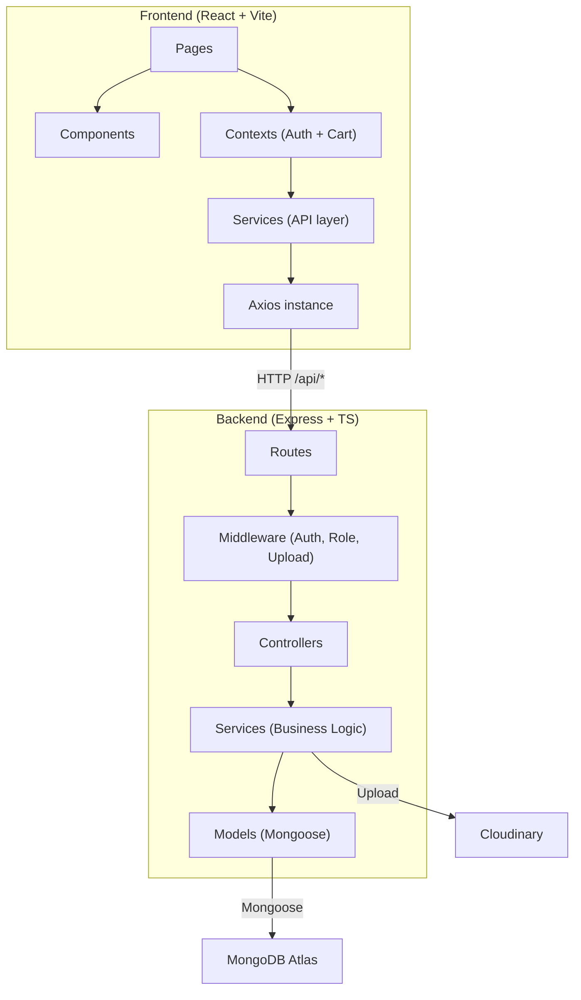

# 🔍 Diagnostic Complet — MarketElectro E-Commerce

## 📋 Vue d'ensemble du projet

| Aspect | Détail |
|---|---|
| **Nom** | MarketElectro (CodeAlpha_FS_01) |
| **Backend** | Node.js + Express 5 + TypeScript + MongoDB (Mongoose 9) |
| **Frontend** | React 19 + TypeScript + Vite 8 + TailwindCSS 4 + shadcn/ui |
| **Auth** | JWT (jsonwebtoken) + bcryptjs |
| **Upload** | Multer (mémoire) → Cloudinary |
| **API Doc** | Swagger UI (route `/api/docs`) |
| **Base de données** | MongoDB Atlas (cluster répliqué) |

---

## 🏗️ Architecture du projet



---

## ✅ Fonctionnalités implémentées

### Backend — API REST

| Module | Endpoints | Status |
|---|---|---|
| **Authentification** | `POST /api/auth/register`, `POST /api/auth/login`, `GET /api/auth/profile` | ✅ Fonctionnel |
| **Produits** | `GET /api/products`, `GET /api/products/:id`, `POST`, `PUT`, `DELETE` (admin) | ✅ Fonctionnel |
| **Panier** | `GET /api/cart`, `POST /api/cart`, `PUT /api/cart/:productId`, `DELETE /api/cart/:productId` | ✅ Fonctionnel |
| **Commandes** | `POST /api/orders` (checkout), `GET /api/orders`, `GET /api/orders/:id` | ✅ Fonctionnel |
| **Favoris** | `GET /api/favorites`, `POST /api/favorites/:productId`, `DELETE /api/favorites/:productId` | ✅ Fonctionnel |
| **Profil utilisateur** | `GET /api/users/me`, `PUT /api/users/me`, `PUT /api/users/me/password`, `PUT /api/users/me/avatar`, `DELETE /api/users/me/avatar` | ✅ Fonctionnel |
| **Rôles** | `admin` / `customer` avec middleware d'autorisation | ✅ Fonctionnel |
| **Upload images** | Multer (mémoire, 5MB max, JPG/PNG/WebP) → Cloudinary | ✅ Fonctionnel |
| **Seeds** | Script de seed produits + script de création admin | ✅ Fonctionnel |

### Frontend — Interface utilisateur

| Page/Feature | Status | Notes |
|---|---|---|
| **Login** | ✅ | Design animé (floating labels), styled-components |
| **Register** | ✅ | Formulaire d'inscription |
| **Dashboard** | ⚠️ Basique | Placeholder vide — juste un titre |
| **Catalogue produits** | ✅ | Recherche, filtres par catégorie, skeletons loading |
| **Favoris** | ✅ | Toggle optimiste, filtrage "favoris" dans le catalogue |
| **Panier** | ✅ | Ajout, modification quantité, suppression, résumé |
| **Checkout** | ⚠️ Partiel | Affichage récapitulatif uniquement — pas de paiement |
| **Profil utilisateur** | ⚠️ Fichier présent | Page `ProfilePage.tsx` existe mais contenu non vérifié |
| **Routing protégé** | ✅ | `ProtectedRoute` avec redirection `/login` |
| **Context Auth** | ✅ | Provider + hook + localStorage |
| **Context Panier** | ✅ | Provider + hook + sync backend |
| **Notifications toast** | ✅ | `sonner` intégré |

---

## 🔴 DIAGNOSTIC CYBERSÉCURITÉ

> [!CAUTION]
> **Plusieurs vulnérabilités critiques ont été identifiées. Ce projet ne doit PAS être déployé en production dans son état actuel.**

### 🚨 Vulnérabilités CRITIQUES

#### 1. Fichier `.env` commité dans le dépôt Git
**Fichier** : [.env](file:///c:/Users/DELL/Downloads/SEMESTRE2025-2026/CODEALPHA/task1/backend/.env)

Le fichier `.env` est bien listé dans `.gitignore`, **MAIS il existe physiquement** dans le dépôt avec :
- 🔑 **URI MongoDB Atlas** complète (identifiants inclus : `amegadjinkomlanjosue_db_user:K15l0ANN1SX1AWC3`)
- 🔑 **JWT_SECRET** en clair (512 bits)
- 🔑 **Mot de passe admin** en clair : `admin123456`
- 🔑 **Clés Cloudinary** complètes (API Key + API Secret)

**Impact** : Quiconque accède au repo a un accès total à votre base de données, peut forger des JWT et manipuler vos images Cloudinary.

**Remédiation** :
1. **Immédiatement** révoquer et régénérer : mot de passe MongoDB, JWT_SECRET, clés Cloudinary
2. Supprimer le fichier de l'historique Git (`git filter-branch` ou BFG)
3. Changer le mot de passe admin en base

#### 2. CORS configuré en mode "ouvert total"
**Fichier** : [app.ts](file:///c:/Users/DELL/Downloads/SEMESTRE2025-2026/CODEALPHA/task1/backend/src/app.ts#L29)

```typescript
app.use(cors()); // ← AUCUNE restriction d'origine
```

**Impact** : N'importe quel site web peut appeler votre API et exploiter les cookies/tokens de vos utilisateurs (attaques CSRF).

**Remédiation** :
```typescript
app.use(cors({
  origin: ['http://localhost:5173', 'https://votre-domaine.com'],
  credentials: true,
  methods: ['GET', 'POST', 'PUT', 'DELETE'],
}));
```

#### 3. Mot de passe admin faible et hardcodé
**Fichier** : [create-admin.ts](file:///c:/Users/DELL/Downloads/SEMESTRE2025-2026/CODEALPHA/task1/backend/script/create-admin.ts#L22)

```typescript
const hashedPassword = await bcrypt.hash("admin123456", 10);
```

Et dans `.env` : `ADMIN_PASSWORD=admin123456`

**Impact** : Mot de passe trivial, devinable en quelques secondes par brute-force.

#### 4. Aucune validation des entrées côté backend
**Fichiers** : Tous les controllers

Les données `req.body` sont passées directement aux services **sans aucune validation** :
```typescript
const product = await createProduct(req.body); // ← Injection possible
const user = await registerUser(req.body);     // ← Pas de validation email/password
```

**Impact** : 
- Injection NoSQL possible (ex: `{"email": {"$gt": ""}}`)
- Création d'utilisateurs avec des mots de passe vides
- Manipulation de champs non prévus (mass assignment)

**Remédiation** : Ajouter `zod` ou `joi` pour valider chaque endpoint.

#### 5. Tokens JWT sans mécanisme de révocation
**Fichier** : [jwt.ts](file:///c:/Users/DELL/Downloads/SEMESTRE2025-2026/CODEALPHA/task1/backend/src/utils/jwt.ts)

- JWT expire après **7 jours** (`JWT_EXPIRES_IN=7d`)
- **Aucune blacklist** de tokens
- **Aucun refresh token**

**Impact** : Un token volé reste valide 7 jours sans possibilité de l'invalider.

#### 6. Token stocké en `localStorage` (XSS → vol de session)
**Fichier** : [AuthContext.tsx](file:///c:/Users/DELL/Downloads/SEMESTRE2025-2026/CODEALPHA/task1/frontend/src/contexts/AuthContext.tsx#L66)

```typescript
localStorage.setItem("token", token);
```

**Impact** : Une faille XSS permet de voler immédiatement le token. Les cookies `httpOnly` + `SameSite=Strict` sont beaucoup plus sûrs.

### ⚠️ Vulnérabilités MOYENNES

#### 7. Aucun Rate Limiting
Aucun middleware de limitation de débit sur les routes sensibles (`/login`, `/register`).

**Impact** : Brute-force illimité sur les identifiants, spam de création de comptes.

**Remédiation** : Ajouter `express-rate-limit` :
```typescript
import rateLimit from 'express-rate-limit';
const authLimiter = rateLimit({ windowMs: 15 * 60 * 1000, max: 10 });
app.use('/api/auth', authLimiter);
```

#### 8. Aucun Helmet (headers de sécurité HTTP)
Pas de headers comme `X-Content-Type-Options`, `X-Frame-Options`, `Content-Security-Policy`, `Strict-Transport-Security`.

**Remédiation** : `app.use(helmet());`

#### 9. Pas de vérification du stock lors de l'ajout au panier
**Fichier** : [cart.services.ts](file:///c:/Users/DELL/Downloads/SEMESTRE2025-2026/CODEALPHA/task1/backend/src/services/cart.services.ts#L25-L73)

Le stock n'est vérifié qu'au moment du checkout. Un utilisateur peut ajouter 10000 unités au panier.

#### 10. Messages d'erreur exposés directement
```typescript
res.status(400).json({ message: error.message }); // ← Stack traces possibles
```

**Impact** : Les erreurs Mongoose/Node peuvent révéler la structure de la DB.

#### 11. Soft-delete incomplet pour les produits
**Fichier** : [product.services.ts](file:///c:/Users/DELL/Downloads/SEMESTRE2025-2026/CODEALPHA/task1/backend/src/services/product.services.ts#L75-L95)

`deleteProduct` met juste `isActive: false`, mais `getProductById` ne filtre PAS par `isActive`, donc un produit "supprimé" reste accessible par ID.

#### 12. Pas de pagination
`getAllProducts()` retourne TOUS les produits d'un coup. Avec des milliers de produits, cela cause des problèmes de performance.

#### 13. Route `/checkout` non protégée côté frontend
**Fichier** : [AppRoutes.tsx](file:///c:/Users/DELL/Downloads/SEMESTRE2025-2026/CODEALPHA/task1/frontend/src/routes/AppRoutes.tsx#L27)

```tsx
<Route path="/checkout" element={<CheckoutPage />} />  // ← Hors de ProtectedRoute !
```

#### 14. Script `testUser.ts` crée un utilisateur avec mot de passe en clair
**Fichier** : [testUser.ts](file:///c:/Users/DELL/Downloads/SEMESTRE2025-2026/CODEALPHA/task1/backend/src/testUser.ts#L14-L18)

Le mot de passe `"123456"` est stocké **sans hashage** dans MongoDB.

---

## 🔶 Fonctionnalités MANQUANTES pour un e-commerce viable

### 🔴 Indispensables (P0)

| Fonctionnalité | Description | Priorité |
|---|---|---|
| **💳 Paiement** | Intégration Stripe/PayPal — le bouton "Continue to payment" ne mène nulle part | 🔴 CRITIQUE |
| **🛡️ Validation des entrées** | Schemas Zod/Joi sur chaque route | 🔴 CRITIQUE |
| **🔒 Sécurisation CORS** | Whitelist des origines autorisées | 🔴 CRITIQUE |
| **🧢 Helmet** | Headers HTTP de sécurité | 🔴 CRITIQUE |
| **⏱️ Rate Limiting** | Prévention brute-force | 🔴 CRITIQUE |
| **📧 Email de confirmation** | Vérification email à l'inscription | 🔴 IMPORTANT |
| **🔑 Mot de passe oublié** | Bouton "Forgot Password" présent mais non fonctionnel | 🔴 IMPORTANT |
| **📄 Page d'accueil** | Pas de landing page — aucune route `/` côté frontend | 🔴 IMPORTANT |
| **📦 Gestion des statuts de commande** | Pas de route admin pour confirmer/annuler une commande | 🔴 IMPORTANT |

### 🟡 Importantes (P1)

| Fonctionnalité | Description |
|---|---|
| **📋 Pagination** | Pagination des produits, commandes (+ infinite scroll) |
| **🔍 Recherche avancée** | Filtres par prix, tri (prix, date, popularité) |
| **📱 Design responsive** | Test mobile approfondi |
| **🖼️ Galerie produit** | Multi-images par produit (actuellement 1 seule) |
| **⭐ Avis et notes** | Système de reviews avec moyenne |
| **📊 Dashboard admin** | Statistiques ventes, gestion produits/commandes/utilisateurs |
| **📤 Upload image produit** | Formulaire admin pour upload via Cloudinary (l'infra existe) |
| **🧾 Factures/Reçus** | Génération PDF après commande |
| **📍 Adresses de livraison** | Modèle `Address` lié à l'utilisateur |
| **📬 Notifications email** | Confirmation commande, changement de statut |
| **🌐 i18n** | Interface actuellement mixte FR/EN — standardiser |

### 🟢 Nice-to-have (P2)

| Fonctionnalité | Description |
|---|---|
| **🔎 Recherche full-text** | MongoDB Atlas Search ou Elasticsearch |
| **📱 PWA** | Service worker, installation sur mobile |
| **🏷️ Système de coupons/promotions** | Codes promo, % de réduction |
| **📊 Analytics** | Tracking comportemental (GA4, Mixpanel) |
| **💬 Chat support** | Live chat ou chatbot |
| **🚚 Suivi de livraison** | Tracking numéro de colis |
| **🔄 Gestion des retours** | Demande de remboursement |
| **🌙 Dark mode** | `next-themes` est installé mais non utilisé |
| **🧪 Tests** | Aucun test unitaire ni E2E (0% de couverture) |
| **📝 Documentation API** | Le Swagger est vide (juste un titre, pas d'endpoints documentés) |

---

## 📊 Bilan de qualité du code

### Points positifs ✅
- Architecture **MVC bien structurée** (routes → controllers → services → models)
- Séparation claire frontend/backend
- TypeScript des deux côtés
- Utilisation de **interfaces typées** pour les données
- **Soft-delete** des produits (conserve l'historique)
- **Optimistic updates** sur les favoris côté frontend
- **Contexts React** bien isolés (Auth + Cart)
- Upload Cloudinary avec suppression de l'ancien fichier
- Stock décrémenté automatiquement au checkout
- Panier créé automatiquement à l'inscription

### Points à améliorer ⚠️
- **Aucun test** (0 test unitaire, 0 test d'intégration, 0 E2E)
- **Mélange FR/EN** dans le code et les messages
- **Pas de gestion d'erreurs centralisée** (try/catch répétitif dans chaque controller)
- **Pas de logger** (juste `console.log/error`)
- **Swagger vide** — la doc API ne contient aucun endpoint
- **Duplication** de code (fichiers `jwt.ts` ET `jwt.js` dans utils)
- `ProfilePage.tsx` existe mais son contenu n'est pas intégré au routing
- Le dashboard est un placeholder vide
- Pas de page 404

---

## 🎯 Roadmap recommandée

### Phase 1 — Sécurisation immédiate (1-2 jours)
1. ✅ Régénérer TOUTES les clés exposées (MongoDB, JWT, Cloudinary)
2. ✅ Ajouter `helmet()` + CORS restrictif
3. ✅ Ajouter `express-rate-limit` sur `/auth`
4. ✅ Ajouter validation Zod sur chaque route
5. ✅ Protéger la route `/checkout` côté frontend

### Phase 2 — Fonctionnalités critiques (1-2 semaines)
1. Intégration paiement (Stripe Checkout)
2. Page d'accueil / Landing page
3. Email de confirmation + Mot de passe oublié
4. Dashboard admin (CRUD produits, gestion commandes)
5. Pagination API + frontend
6. Gestion des statuts de commande (admin)

### Phase 3 — Amélioration UX (2-3 semaines)
1. Design responsive mobile
2. Multi-images produit
3. Système d'avis et notes
4. Adresses de livraison
5. Notifications email (nodemailer/SendGrid)
6. Page profil complète
7. Page 404

### Phase 4 — Scaling (optionnel)
1. Tests (Vitest + Supertest + Playwright)
2. CI/CD pipeline
3. Docker / déploiement cloud
4. Monitoring et logging (Winston/Pino)
5. Dark mode (l'infra `next-themes` est déjà installée)

---

> [!IMPORTANT]
> **Priorité absolue** : régénérer les secrets exposés dans le `.env` et nettoyer l'historique Git avant tout push public. Les clés MongoDB Atlas, JWT et Cloudinary sont toutes compromises.
